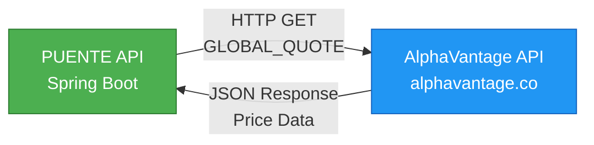
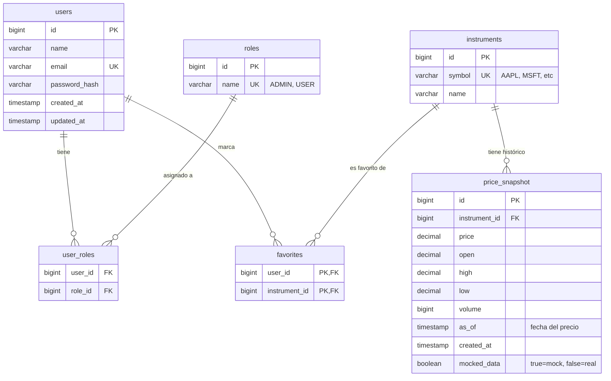

# PUENTE API - Technical Interview Challenge

API REST para gestión de instrumentos financieros con autenticación JWT, integración con AlphaVantage y actualización automática de precios.

---

## Tabla de Contenidos

- [Descripción General](#descripción-general)
- [Tecnologías](#tecnologías)
- [Arquitectura](#arquitectura)
- [Diagramas del Sistema](#diagramas-del-sistema)
- [Requisitos Previos](#requisitos-previos)
- [Instalación y Ejecución](#instalación-y-ejecución)
- [Endpoints API](#endpoints-api)
- [Testing](#testing)
- [Estructura del Proyecto](#estructura-del-proyecto)
- [Decisiones Técnicas Clave](#decisiones-técnicas-clave)
- [Autor](#autor)
- [Licencia](#licencia)

---

## Descripción General

Microservicio backend que implementa:

- **Autenticación JWT**: Registro y login de usuarios con roles (USER/ADMIN)
- **Gestión de Instrumentos**: Catálogo de 5 instrumentos financieros (AAPL, MSFT, GOOGL, AMZN, META)
- **Precios en Tiempo Real**: Integración con AlphaVantage API con fallback a mock data
- **Sistema de Favoritos**: Los usuarios pueden marcar instrumentos como favoritos
- **Actualización Automática**: Job scheduler que actualiza precios cada 5 minutos
- **Auditoría**: Log de acciones críticas del sistema

---

## Tecnologías

### Core Stack
- **Java 17** - LTS version
- **Spring Boot 3.3.3** - Framework principal
- **PostgreSQL 16** - Base de datos relacional
- **Maven 3.9+** - Gestión de dependencias

### Spring Ecosystem
- **Spring Data JPA** - Capa de persistencia
- **Spring Security** - Autenticación y autorización
- **Spring Cache + Caffeine** - Caché in-memory (TTL 5min)
- **Spring Scheduler** - Jobs programados
- **Spring Actuator** - Health checks

### Seguridad
- **JWT (JJWT 0.11.5)** - Tokens de autenticación
- **BCrypt** - Hash de contraseñas

### Infraestructura
- **Flyway** - Migraciones de base de datos
- **Docker + Docker Compose** - Containerización
- **SpringDoc OpenAPI** - Documentación Swagger UI

### Testing
- **JUnit 5** - Framework de testing
- **Testcontainers** - Tests de integración con PostgreSQL
- **AssertJ** - Assertions expresivas

---

## Arquitectura

### Arquitectura Hexagonal (Ports & Adapters)

```
┌──────────────────────────────────────────────────────────────┐
│                     API LAYER (Controllers)                  │
│                                                              │
│  AuthController   UserController   InstrumentController      │
│  FavoriteController                                          │
└───────────────────────────┬──────────────────────────────────┘
                            │ DTOs
┌───────────────────────────▼──────────────────────────────────┐
│                  APPLICATION LAYER (Services)                │
│                                                              │
│  AuthService   UserService   InstrumentService               │
│  FavoriteService   AuditService                              │
└───────────────────────────┬──────────────────────────────────┘
                            │ Domain Objects
┌───────────────────────────▼──────────────────────────────────┐
│                    DOMAIN LAYER (Entities)                   │
│                                                              │
│  User   Role   Instrument   PriceSnapshot   Favorite         │
│  AuditLog                                                    │
└───────────────────────────┬──────────────────────────────────┘
                            │ Adapters
┌───────────────────────────▼──────────────────────────────────┐
│              INFRASTRUCTURE LAYER (Adapters)                 │
│                                                              │
│  Persistence (JPA + PostgreSQL)                              │
│  Security (JWT + Filters)                                    │
│  External API (AlphaVantage Client)                          │
│  Scheduler (Price Update Job)                                │
│  Config (Cache, Security, OpenAPI)                           │
└──────────────────────────────────────────────────────────────┘
```

**Beneficios de esta arquitectura:**
- Independencia de frameworks en el dominio
- Alta testabilidad mediante inyección de dependencias
- Facilidad para cambiar implementaciones de infraestructura
- Separación clara de responsabilidades

---

## Diagramas del Sistema

### Integración con AlphaVantage API



**Flujo:**
1. El scheduler ejecuta cada 5 minutos el job de actualización de precios
2. Para cada instrumento, se realiza una petición HTTP GET al endpoint `GLOBAL_QUOTE` de AlphaVantage
3. La respuesta JSON contiene: precio actual, apertura, máximo, mínimo, volumen y fecha
4. Los datos se persisten en `price_snapshot` con el flag `mocked_data=false`
5. Si la API falla o está limitada, se utilizan datos mock con `mocked_data=true`

### Modelo de Base de Datos



**Relaciones:**
- **users ↔ roles**: Relación N:N mediante tabla intermedia `user_roles`
- **users ↔ instruments**: Relación N:N mediante `favorites` (instrumentos favoritos del usuario)
- **instruments ↔ price_snapshot**: Relación 1:N (un instrumento tiene múltiples snapshots históricos)

---

## Requisitos Previos

- **Docker** y **Docker Compose** instalados

### API Key de AlphaVantage (Opcional)

La aplicación funciona con datos mock si no se proporciona una API key válida.

Para obtener una API key gratuita:
1. Visitar https://www.alphavantage.co/support/#api-key
2. Completar el formulario de registro
3. Usar la key recibida por email

**Nota**: El tier gratuito permite 25 requests/día y 5 requests/minuto.

---

## Instalación y Ejecución

### Build y ejecución con Docker Compose

```bash
# Clonar el repositorio
git clone <repository-url>
cd puente-app

# Opcional: Configurar API key
echo "ALPHAVANTAGE_API_KEY=your_api_key_here" > .env

# Build y levantar servicios
docker compose up --build -d

# Ver logs
docker compose logs -f app
```

### Acceso a la aplicación

- **API Base**: http://localhost:8080
- **Swagger UI**: http://localhost:8080/swagger-ui.html
- **Health Check**: http://localhost:8080/actuator/health

### Usuario admin predefinido

```
Email: fcaminos@puente.com
Password: puente
```

### Detener servicios

```bash
# Detener sin eliminar datos
docker compose down

# Detener y eliminar volúmenes (reset completo)
docker compose down -v
```

### Conectar a PostgreSQL (opcional)

```
Host: localhost
Port: 5432
Database: puente
Username: puente
Password: puente123
```

---

## Endpoints API

### Autenticación

| Método | Endpoint | Descripción | Auth |
|--------|----------|-------------|------|
| POST | `/api/auth/register` | Registrar nuevo usuario | No |
| POST | `/api/auth/login` | Iniciar sesión y obtener JWT | No |

**Ejemplo - Login:**
```bash
curl -X POST http://localhost:8080/api/auth/login \
  -H "Content-Type: application/json" \
  -d '{"email":"fcaminos@puente.com","password":"puente"}'
```

### Usuarios

| Método | Endpoint | Descripción | Auth |
|--------|----------|-------------|------|
| GET | `/api/users/me` | Obtener perfil propio | USER |
| PUT | `/api/users/me` | Actualizar perfil propio | USER |
| PUT | `/api/users/me/password` | Cambiar contraseña | USER |
| GET | `/api/users` | Listar todos los usuarios | ADMIN |
| GET | `/api/users/{id}` | Obtener usuario por ID | ADMIN |
| DELETE | `/api/users/{id}` | Eliminar usuario | ADMIN |
| POST | `/api/users/{id}/promote` | Promover usuario a ADMIN | ADMIN |

### Instrumentos Financieros

| Método | Endpoint | Descripción | Auth |
|--------|----------|-------------|------|
| GET | `/api/instruments` | Listar todos los instrumentos | USER |
| GET | `/api/instruments/{symbol}` | Obtener detalles e precio actual | USER |

**Símbolos disponibles**: AAPL, MSFT, GOOGL, AMZN, META

**Ejemplo - Obtener precio de Apple:**
```bash
curl -X GET http://localhost:8080/api/instruments/AAPL \
  -H "Authorization: Bearer {token}"
```

**Respuesta incluye:**
- Precio actual (`price`)
- Apertura, máximo, mínimo (`open`, `high`, `low`)
- Volumen de transacciones
- Origen de datos (`mocked_data`: true/false)

### Favoritos

| Método | Endpoint | Descripción | Auth |
|--------|----------|-------------|------|
| GET | `/api/favorites` | Listar favoritos propios | USER |
| POST | `/api/favorites/{symbol}` | Marcar instrumento como favorito | USER |
| DELETE | `/api/favorites/{symbol}` | Eliminar de favoritos | USER |

### Health Check

| Método | Endpoint | Descripción | Auth |
|--------|----------|-------------|------|
| GET | `/actuator/health` | Estado de la aplicación | No |

### Documentación Interactiva

Acceder a Swagger UI para probar todos los endpoints:

http://localhost:8080/swagger-ui.html

### Postman Collection

Importar la collection desde `postman/Puente_API.postman_collection.json` para ejemplos completos de todos los endpoints.

---

## Testing

### Ejecutar los tests

```bash
# Todos los tests
mvn test

# Tests específicos
mvn test -Dtest=UserRepositoryTest

# Tests con coverage (requiere plugin jacoco en pom.xml)
mvn test jacoco:report
# Ver reporte en: target/site/jacoco/index.html
```

### Suite de Tests Implementada

**UserRepositoryTest** - 6 tests de integración

Tests de integración con PostgreSQL:

1. **adminUserExistsAfterMigration**: Verifica que el usuario admin existe después de ejecutar migraciones Flyway
2. **rolesExistAfterMigration**: Valida que los roles USER y ADMIN se crean correctamente
3. **createNewUserWithUserRole**: Crea un usuario nuevo y verifica persistencia y relaciones
4. **cannotCreateUserWithDuplicateEmail**: Valida el constraint de email único
5. **findAllUsersReturnsAtLeastAdminUser**: Verifica la consulta de listado de usuarios
6. **findByEmailIsCaseSensitive**: Documenta que la búsqueda es case-sensitive

### Estructura de Tests

```
src/test/java/
├── com/puente/app/
│   ├── UserRepositoryTest.java       # 6 tests de integración del repositorio
│   └── TestFlywayConfig.java         # Configuración de Flyway para tests
└── containers/
    ├── AbstractIntegrationTest.java  # Clase base para tests de integración
    └── PostgresTestContainer.java    # Configuración de contenedor PostgreSQL
```

### Tecnologías de Testing

- **JUnit 5**: Framework de testing
- **Testcontainers**: PostgreSQL 16 en contenedor Docker
- **Spring Data JPA**: Tests de integración con repositorios
- **AssertJ**: Assertions fluidas y expresivas
- **Flyway**: Validación de migraciones

### Resultado de Tests

```
Tests run: 6, Failures: 0, Errors: 0, Skipped: 0
```

Tiempo de ejecución: ~7 segundos

---

## Estructura del Proyecto

```
puente-app/
├── src/
│   ├── main/
│   │   ├── java/com/puente/app/
│   │   │   ├── api/
│   │   │   │   ├── controller/          # Controladores REST
│   │   │   │   ├── dto/                 # Objetos de transferencia de datos
│   │   │   │   └── mapper/              # Mapeo entre DTOs y entidades
│   │   │   ├── application/             # Servicios (lógica de aplicación)
│   │   │   ├── domain/
│   │   │   │   ├── user/                # Entidades User y Role
│   │   │   │   ├── instrument/          # Entidades Instrument y PriceSnapshot
│   │   │   │   ├── favorite/            # Entidad Favorite
│   │   │   │   └── audit/               # Entidad AuditLog
│   │   │   └── infrastructure/
│   │   │       ├── config/              # Configuraciones de Spring
│   │   │       ├── security/            # JWT, filtros, UserDetails
│   │   │       ├── persistence/         # Repositorios JPA
│   │   │       ├── alphavantage/        # Cliente API AlphaVantage
│   │   │       └── scheduler/           # Job de actualización de precios
│   │   └── resources/
│   │       ├── application.yml          # Configuración principal
│   │       ├── mock-data/
│   │       │   └── financial-instruments.json  # Datos mock de fallback
│   │       └── db/migration/            # Scripts SQL de Flyway
│   │           ├── V1__init_schema.sql
│   │           ├── V2__seed_instruments.sql
│   │           ├── V3__seed_admin_user.sql
│   │           └── V4__add_mocked_data_column.sql
│   └── test/
│       └── java/com/puente/
│           ├── app/                     # Tests de integración
│           └── containers/              # Configuración de Testcontainers
├── postman/
│   └── Puente_API.postman_collection.json
├── docker-compose.yml
├── Dockerfile
├── pom.xml
├── .env.example
└── README.md
```

---

## Decisiones Técnicas Clave

### WebClient vs RestTemplate

Se eligió **WebClient** (Spring WebFlux) para la integración con AlphaVantage API.

**Razones:**
- API moderna y no-bloqueante (aunque se usa en modo síncrono con `.block()`)
- Mejor soporte para configuraciones avanzadas (timeouts, headers personalizados)
- RestTemplate está en modo maintenance desde Spring 5.x
- Preparado para escalabilidad futura con programación reactiva si se requiere

### Encriptación de Contraseñas: BCrypt

Se utiliza **BCrypt** vía `BCryptPasswordEncoder` de Spring Security.

**Razones:**
- Algoritmo de hashing adaptativo (ajustable con factor de trabajo)
- Protección contra ataques de rainbow tables y fuerza bruta
- Estándar de la industria y recomendado por OWASP

### Caché: Caffeine

Se implementó **Caffeine** como proveedor de caché in-memory con TTL de 5 minutos.

**Razones:**
- Limitaciones de AlphaVantage API tier gratuito: **25 requests/día** y **5 requests/minuto**
- Performance: respuestas instantáneas sin llamadas a la API externa
- Simplicidad: no requiere infraestructura adicional (Redis) para este caso de uso
- Alta performance: mejor que ConcurrentHashMap y otras implementaciones

**Trade-off:** En un entorno multi-instancia se requeriría Redis distribuido.

### Mock Data Fallback

Se implementó un sistema de datos mock con fallback automático.

**Razones:**
- AlphaVantage tier gratuito es muy limitado (25 calls/día)
- Permite demostración completa del sistema sin depender de la disponibilidad de API externa
- Campo `mocked_data` en `price_snapshot` indica origen de los datos

### Migraciones: Flyway

Se implementó **Flyway** para gestión de esquema de base de datos.

**Razones:**
- Migraciones reproducibles en cualquier entorno
- Validación de integridad en cada startup
- SQL puro: transparente y fácil de auditar

### Reducción de Instrumentos (20 → 5)

Se redujeron los instrumentos de 20 a 5 (AAPL, MSFT, GOOGL, AMZN, META).

**Razones:**
- Optimización del consumo de API: 5 símbolos × 5 min = 60 calls/hora
- Tier gratuito de AlphaVantage solo permite 25 requests/día
- Suficiente para demostración de funcionalidad

---

## Autor

**Franco Caminos**
Proyecto: PUENTE - Backend Java Technical Challenge  
Fecha: Octubre 2025

---

## Licencia

Este proyecto fue desarrollado como parte de una evaluación técnica para PUENTE.